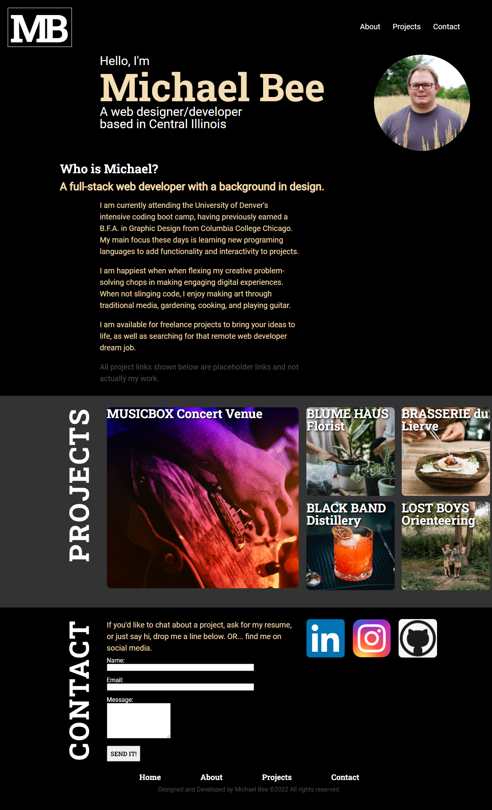

<h1>Professional Portfolio of Michael Bee</h1>

<h2>Project Description:</h2>

A portfolio of work samples for potential employers to review. 

<h2>Table of Contents:</h2>

Home page with navigation links to About, Projects, and Contact sections.

About Section: An introduction to Michael Bee's education, experience, career aspirations, and personal interests. 

Projects Section: Image links to placeholder projects, to be filled with images and links to actual projects at a later date.

Contact Section: Email form and social media links to contact Michael Bee.

<h2>Screenshot:</h2>

<h2>How to Install and Run:</h2>

Clone from Michael-Bee's repository at https://github.com/Michael-Bee/Professional_Portfolio
Visit page at https://michael-bee.github.io/Professional_Portfolio/

<h2>Credits:</h2>

Made by Michael Bee, 2022

<h2>Resources:</h2>

https://fonts.google.com/

https://www.w3schools.com/

https://developer.mozilla.org/en-US/

https://blog.getform.io/how-to-create-an-html-form-that-sends-you-an-email/

https://www.youtube.com/watch?v=VCNlRNwIZcQ

<h2>License:</h2> 

MIT License
Copyright (c) [2022] [Michael Bee]

Permission is hereby granted, free of charge, to any person obtaining a copy
of this software and associated documentation files (the "Software"), to deal
in the Software without restriction, including without limitation the rights
to use, copy, modify, merge, publish, distribute, sublicense, and/or sell
copies of the Software, and to permit persons to whom the Software is
furnished to do so, subject to the following conditions:

The above copyright notice and this permission notice shall be included in all
copies or substantial portions of the Software.

THE SOFTWARE IS PROVIDED "AS IS", WITHOUT WARRANTY OF ANY KIND, EXPRESS OR
IMPLIED, INCLUDING BUT NOT LIMITED TO THE WARRANTIES OF MERCHANTABILITY,
FITNESS FOR A PARTICULAR PURPOSE AND NONINFRINGEMENT. IN NO EVENT SHALL THE
AUTHORS OR COPYRIGHT HOLDERS BE LIABLE FOR ANY CLAIM, DAMAGES OR OTHER
LIABILITY, WHETHER IN AN ACTION OF CONTRACT, TORT OR OTHERWISE, ARISING FROM,
OUT OF OR IN CONNECTION WITH THE SOFTWARE OR THE USE OR OTHER DEALINGS IN THE
SOFTWARE.